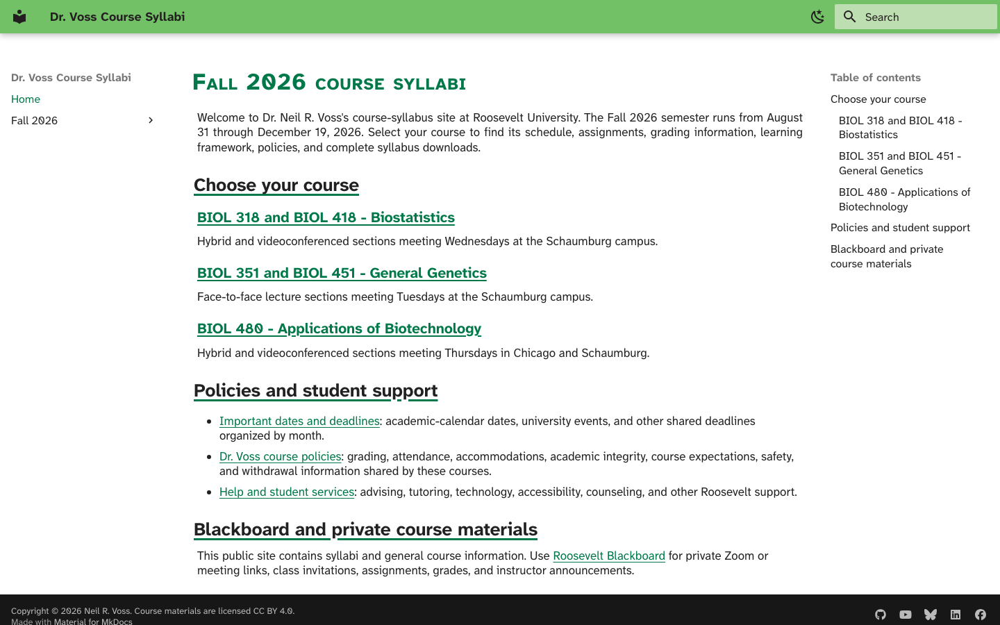
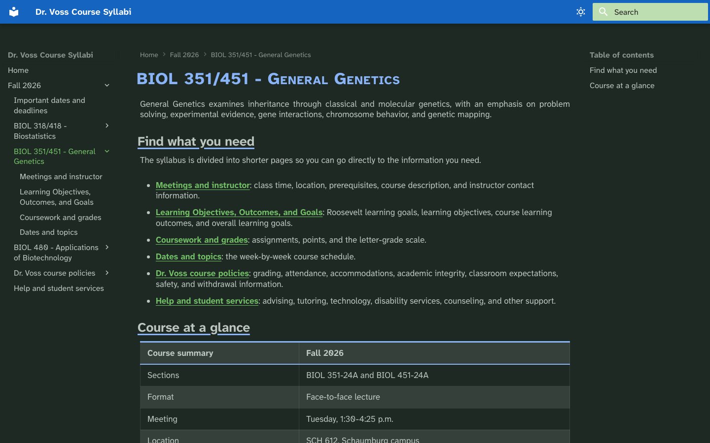

# Syllabus

An accessibility-focused publishing system that turns separately maintained course pages,
policies, and resources into a navigable student website plus complete PDF and DOCX syllabi for
departmental archives.

## Open the live syllabi

**[Open the Fall 2026 course syllabi on GitHub Pages](https://vosslab.github.io/syllabus/)**

Students can use the public site without installing anything. It provides direct routes to
Biostatistics, General Genetics, and Applications of Biotechnology, plus shared dates, policies,
support resources, and complete syllabus downloads.

<!-- screenshots:begin (managed by screenshot-docs) -->


*The student homepage puts current courses, shared policies, support, and Blackboard context on one
screen.*



*Course pages keep task links and the course summary visible while preserving the course-specific
header identity.*
<!-- screenshots:end -->

## One source, three student-ready forms

Students should not need to navigate a 30-page document to find one deadline or policy. This
project keeps web pages short and task-oriented while preserving a complete downloadable syllabus.
Shared policy topics and resources stay independently editable and are assembled once during each
build. Repeated context such as office hours is embedded from one canonical Markdown fragment.

```text
course Markdown + shared policies + student resources
  |-- MkDocs Material --------------------> navigable static website
  |-- Pandoc + reference document --------> complete DOCX
  `-- Python-Markdown + WeasyPrint -------> complete tagged PDF
```

- Course schedules, grading, learning frameworks, and policies remain ordinary Markdown.
- Course-specific colors provide a restrained website and PDF identity; DOCX remains neutral.
- Atkinson Hyperlegible Next is self-hosted for predictable, readable website typography.
- Credential scanning rejects common meeting links, passcodes, and private invitations.
- Every successful build produces complete student-facing candidates without draft-state banners.

## Quick start

The primary local workflow uses macOS, Homebrew, and Python 3.12. Install the document tools and
Python dependencies, then build all downloads and the strict static site:

```bash
brew bundle
source source_me.sh
python3 -m pip install -r pip_requirements.txt -r pip_requirements-dev.txt
python3 pipeline/build_site.py
```

A successful build refreshes important dates from Google Sheets, creates `site/index.html`, and
creates complete course documents under the ignored `site_docs/downloads/` directory. Preview the
result in a temporary local server:

```bash
./run_web_server.sh
```

The preview opens in the default browser and stops after five minutes. See
[docs/INSTALL.md](docs/INSTALL.md) for system dependencies, optional browser-audit setup, and the
document-rendering stack.

## Authoring a course

Public content is organized by term. Each course owns its short student pages and a manifest that
defines the complete-document order; term-wide pages live together under `shared/`:

```text
site_docs/fall_2026/
|-- index.md
|-- biostats/
|-- biotech/
|-- genetics/
|-- shared/
|   |-- IMPORTANT_DATES.md
|   |-- INSTRUCTOR_INFORMATION.md
|   |-- STUDENT_RESOURCES.md
|   |-- fragments/
|   |   |-- INSTRUCTOR_CONTACT_DETAILS.md
|   |   `-- ROOSEVELT_LEARNING_GOALS.md
|   `-- policies/
|       |-- index.md
|       |-- ACADEMIC_INTEGRITY.md
|       |-- ASSESSMENT.md
|       `-- ...
`-- ...
```

For Fall 2026, `site_docs/fall_2026/` is the only live content authority. Add new course pages
directly there, using the listed file structure and a current course as a structural guide. Shared
policies stay in the term's `shared/policies/` branch rather than being copied into courses or a
parallel template tree. Public shared pages remain directly navigable; include-only Markdown lives
under `shared/fragments/`. The website, PDF files, and DOCX files are generated views of this
Markdown and must not be edited as content sources or committed as substitutes for it.

Historical-term archive design and the first term rollover are deferred until Spring 2027. Do not
create an archived-term or future-term source tree during Fall 2026. Dates remain literal Markdown
so calendar exceptions are explicit rather than hidden behind automatic shifting. See
[docs/USAGE.md](docs/USAGE.md) for the complete authoring, generation, validation, and deferred
archive policy.

## Verification

Run every local validation lane with one command:

```bash
./all_test.sh
```

The runner prints a banner for each phase and stops at the first failure. It runs fast pytest, the
production-oriented export E2E and strict site build, then the Pages production builder and
Playwright. Both build paths refresh the live Google Sheets dates so the aggregate runner exercises
every local entry point. Run a lane individually when investigating a focused failure:

```bash
source source_me.sh
python3 -m pytest tests/
python3 tests/e2e/e2e_include_parity.py
./run_playwright_tests.sh --build
```

Accessibility findings guide improvement but do not claim legal or PDF/UA compliance.

## Current development

`VERSION` identifies 26.08 as the current development version. Its notes remain unreleased until a
human creates the release and tag. See [docs/NEWS.md](docs/NEWS.md) for the student and maintainer
summary, or [docs/RELEASE_HISTORY.md](docs/RELEASE_HISTORY.md) for highlights.

## Documentation

- [docs/INSTALL.md](docs/INSTALL.md) - system tools, Python dependencies, fonts, and audit setup.
- [docs/USAGE.md](docs/USAGE.md) - course authoring, generation, validation, and source ownership.
- [docs/CODE_ARCHITECTURE.md](docs/CODE_ARCHITECTURE.md) - source, rendering, validation, and
  deployment flow.
- [docs/FILE_STRUCTURE.md](docs/FILE_STRUCTURE.md) - repository map and generated boundaries.
- [docs/FILE_FORMATS.md](docs/FILE_FORMATS.md) - syllabus manifest and Markdown include contracts.
- [docs/GITHUB_PAGES_BUILD.md](docs/GITHUB_PAGES_BUILD.md) - artifact-build and deployment boundary,
  local-only semantic tests, and deployment failure triage.
- [docs/HCI_BRIEF.md](docs/HCI_BRIEF.md) - student navigation and accessibility design rationale.
- [docs/RELATED_PROJECTS.md](docs/RELATED_PROJECTS.md) - direct publishing, document, deployment,
  and validation foundations.
- [docs/active_plans/reports/fall_2026_content_review.md](docs/active_plans/reports/fall_2026_content_review.md)
  - non-blocking editorial refinement checklist.
- [docs/CHANGELOG.md](docs/CHANGELOG.md) - implementation decisions, failures, and verification
  evidence.

## License

Course materials are available under the
[Creative Commons Attribution 4.0 International license](LICENSE.CC-BY-4.0.md).
Repository software is available under the
[GNU Lesser General Public License 3.0](LICENSE.LGPL-3.0.md).
