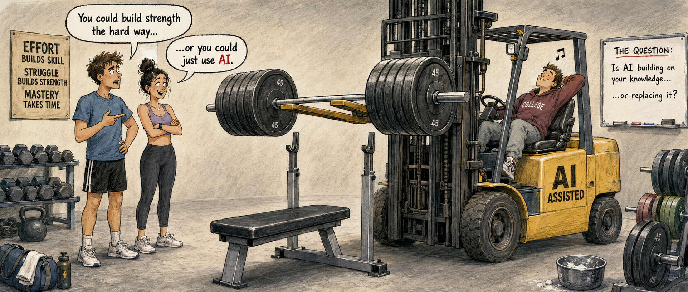

# Academic integrity and AI

## Academic integrity

The university's rules for plagiarism, repurposing, cheating, unauthorized AI use, and other forms
of academic dishonesty are in the
[Academic Integrity Policy and Appeals Procedure (PDF)](https://www.roosevelt.edu/sites/default/files/files/pdfs/policies/Academic/ru-policy-no-0-1-academic-integrity-policy-and-appeals-procedure-rev-08-15-18.pdf){ .file-link .file-link--pdf }.
The university also provides an
[Academic Integrity Guide for Students](https://www.roosevelt.edu/current-students/academics/register-classes/academic-integrity)
with practical guidance for avoiding plagiarism.

Dishonesty of any kind including cheating and plagiarism will not be tolerated. Every semester, I encounter plagiarism and the student says that they did not know it was wrong. If you copy and paste something and turn it in, it is plagiarism. I and the university do not care that you did not know it was wrong, so educate yourself on the meaning of plagiarism and you will be better off.

For combating dishonesty, I use a three-strike system. For the first offense, you earn zero points for that question or section of the assignment and you are reported to the writing center for tutoring. In some rare cases, students will be allowed to re-complete the assignment with reduced points. For the second offense, you earn zero points for the entire assignment. For the third offense, you will earn an F for the course.

If you have any questions about collaboration with your lab partners and classmates, citations and
use of external sources, or any other aspect of academic conduct, ask the instructor. Never assume.

<!-- Do not change this AI policy for Fall 2026. This wording was heavily refined. -->

## How to get the most out of this class in the age of AI

AI tools are amazing. In the hands of an expert, they can increase your ability to find and analyze
information, solve problems, and explain scientific ideas. But you are not yet an expert. You are in
this class to build that expertise, and AI can make that harder if you rely on it too much.[1]

{ .ai-forklift data-document-width=6.5in }

Would you take a forklift to the gym and use it to lift the weights? The forklift can move the
weights, but that is not the purpose of going to the gym. The purpose is to build your own strength.

My goals are to help you understand biology, solve real biological problems, find reliable
information, and present scientific ideas clearly. AI can complete many of these tasks with zero
effort on your part. AI chatbots can produce a polished answer or presentation without helping you
understand the subject. Completing an assignment is not the same as learning the material.

That does not mean never using AI. It means giving yourself time to think before prompting a
chatbot. The question to ask yourself is whether AI is building on your knowledge or replacing it.
Sometimes you will feel lost, get things wrong, look up information yourself, change your mind, and
try again. That struggle is not a failure. It is the cost of becoming an expert, and it is worth the
effort. You will learn much more if you embrace the struggle of figuring things out on your own.

This course relies largely on the honor system. I will not require you to use AI, and I do not plan
to police every use of it. I trust you to make honest choices. However, you are responsible for
everything you submit or present. If you cannot explain the information in your work, then it is not
really your work.

For a further caution about AI-assisted writing, I recommend Colin Carlson's article, "The only
reason you'll ever need not to write with AI."[2] Dr. Carlson prohibits AI in writing because it can
introduce words or ideas whose sources the writer cannot verify. This can create a risk of
plagiarism. The important question is: if someone asks whether the words, ideas, and reasoning you
submitted are genuinely yours, can you honestly answer yes?

### Sources

1. Aaron Clauset, [Biological Networks (CSCI 3352, Fall 2026)](https://aaronclauset.github.io/courses/3352/), syllabus p. 3, University of Colorado Boulder.
2. Colin Carlson, [The only reason you'll ever need not to write with AI](https://www.carlsonlab.bio/thoughts/the-only-reason-youll-ever-need-not-to-write-with-ai), The Carlson Lab.

## Classroom conduct

This classroom will be a safe place for all participants. We will treat one another with respect.

Students enrolled in the university are expected to conduct themselves in a manner compatible with the university's function as an educational institution. Please familiarize yourself with the Student Code of Conduct, the Student Handbook and related procedures:

[Roosevelt University complaint and conflict resolution](https://www.roosevelt.edu/current-students/support-services/complaint/conflict-resolution)

Using music devices either in the classroom or in the laboratory is not permitted. Reading materials other than assigned for teaching are not allowed. No children allowed in the classroom. Cellular phones must be set either to the silent/vibration mode or turned off completely before coming into the classroom. Eating or drinking in classrooms is discouraged, but allowed if you do not create a disturbance. Do not bring loud food packaging to class as they will be disruptive. Examples of unacceptable items include, anything that has condiments, fried chicken, french fries, cereal with milk, and salads. Most things from the vending machine are fine. Rude or disruptive behavior will not be tolerated. If you must leave class for any reason, do not distract your classmates. Courtesy and respect are expected of all our students. Any deviation from such an expectation will be a clear violation of the students code of conduct; an act that will neither be tolerated by the instructor nor the department.
